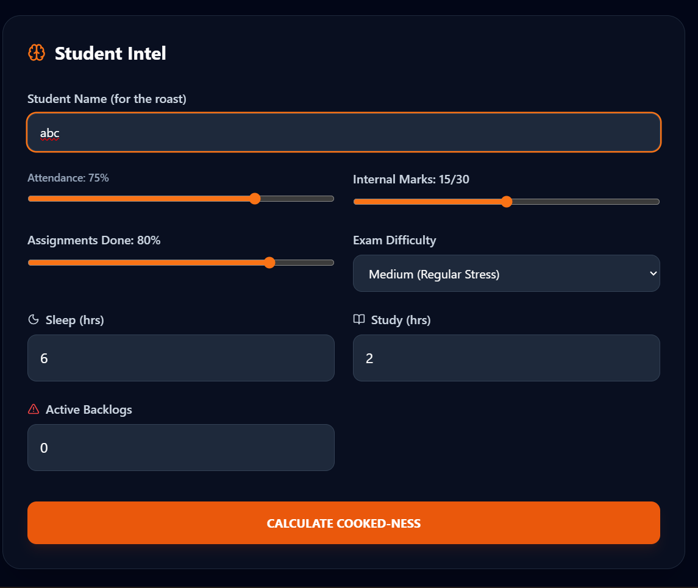
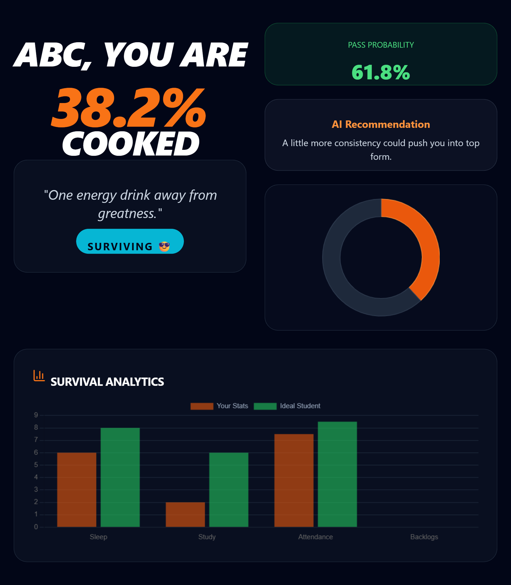

# How Cooked Are You? 🍳

An AI-powered academic survival predictor that estimates how "cooked" a student is before exams.
🚀 Built with React + Flask + Tailwind CSS

## Live Demo

Frontend: Frontend: https://how-cooked-are-you-nine.vercel.app

Backend: https://how-cooked-backend.onrender.com

## Screenshots

### Home Page

### Result Page

## Features

* Cooked Percentage Prediction
* Pass Probability Calculation
* AI Recommendations
* Academic Roast Generator
* Survival Analytics Charts
* Downloadable Result Cards
* Social Sharing

## Highlights

- Developed a full-stack academic prediction platform.
- Built responsive UI using React and Tailwind CSS.
- Created Flask REST API for prediction calculations.
- Integrated analytics visualizations and downloadable result cards.
- Deployed frontend on Vercel and backend on Render.

## Tech Stack

Frontend:

* React
* Vite
* Tailwind CSS
* Chart.js

Backend:

* Flask
* Python

Deployment:

* Vercel
* Render

## Run Locally

Frontend

npm install
npm run dev

Backend

pip install -r requirements.txt
python app.py

## Architecture

Frontend (React + Vite)
        ↓
REST API
        ↓
Backend (Flask)
        ↓
Prediction Engine

## Author

Bhoomika Choudhary

